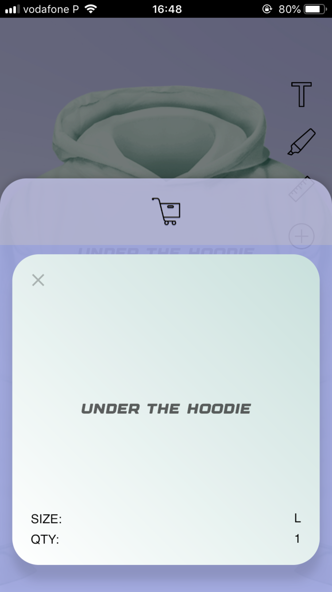

# Under the Hoodie

An application written in Flutter/Dart that allows the user to write a statement in a hoodie and order it from a factory. The application is connected to a backend Google Firebase Database and uses the Stripe API for payments, and also uses Google Cloud Functions for handling more sensitive information.

Notes for using this project:
-Specific Keys for Google Firebase Database and the respective files google-services.json and GoogleServiceinfo.plist were removed.
-Specific keys for Stripe API were removed.
-Code written in the Google Cloud Functions was not updated.

-My general advice is to focus on the "lib" and "flutter_assets" folders to understand and analyse this project.
-If you are trying to replicate it, I suggest setting up Google Firebase Database, Google Cloud Functions and the Stripe API on your own! And solely look at my code on Flutter/Dart

# Screenshots

